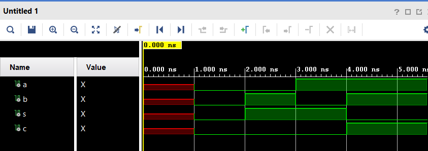
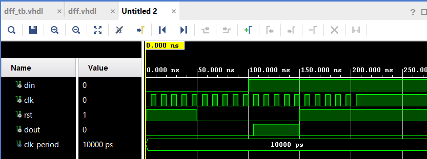

# CPE 322 Lab 1
## VHDL Simulation

### Using Vivado
This lab gives an intro into simulating code written in VHDL, a hardware description language. This language is designed to model and describe digital systems. For this lab I will be simulating the example code in Vivado, a design suite for hardware description languages. 

The first of the example code to run is that for the half adder. In Vivado, you can create a project and directly load in the source files, which is what was done here. From there you simply run the simulation and receive the output shown below.

A second example of this is shown below with the output of the D-Flip Flop (dff) code.

---
> "I pledge my Honor that I have abided by the Stevens Honor System." - George Mularadelis
