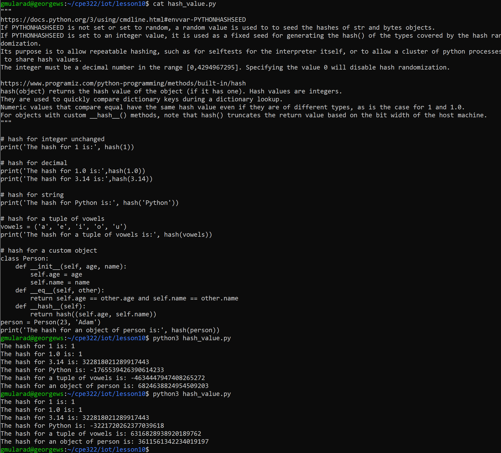
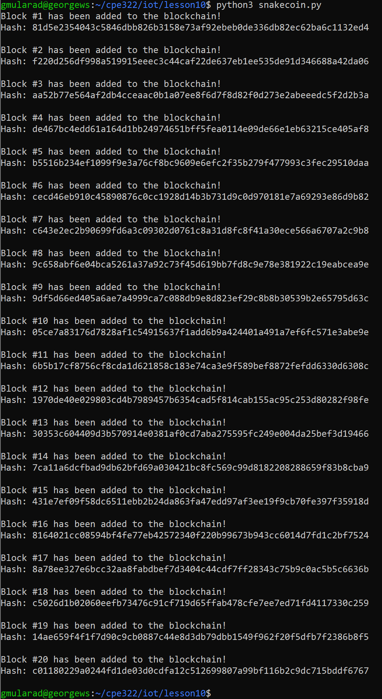
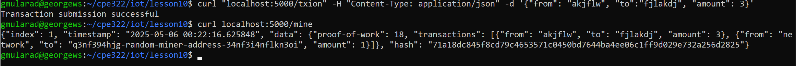
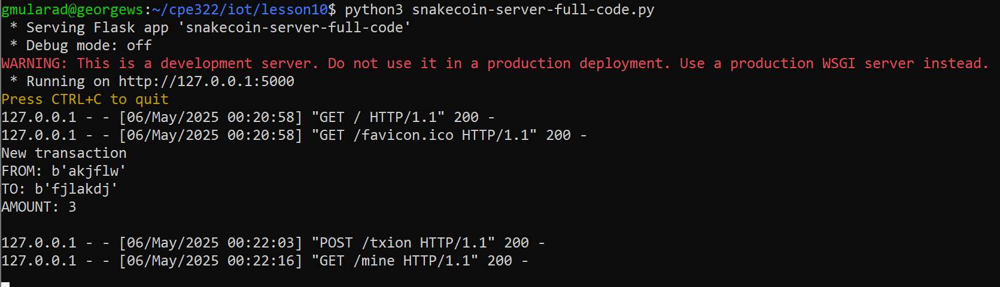
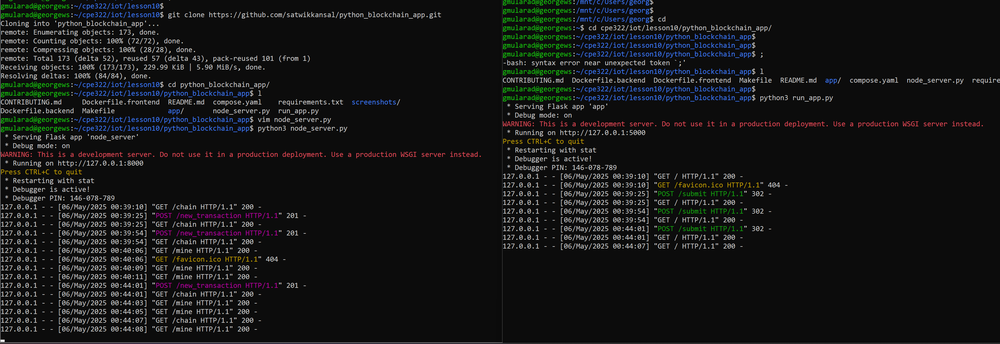
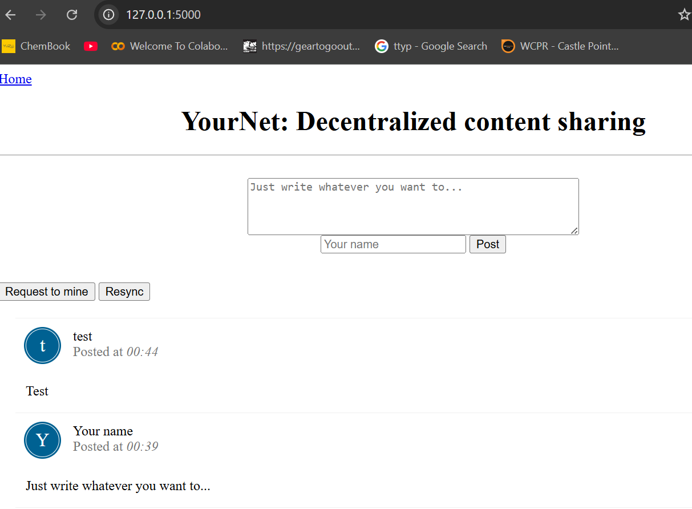

# CPE 322 Lab 10
## Blockchain

### Hashing
The first section of this lab demonstrates hashing capabilities, which is a technique used to secure and verify data. The given python script `hash_value.py` assigns a hash to various different values of different complexities. I observed that as the complexity of the value increased, the hash function gave a more random output, while remaining virtually constant for the numerical values.

### Blockchain
With this knowledge of hashing, I can create a small blockchain using the script `snakecoin.py`. After running the code, it creates a blockchain of length 20, with each value having a unique hash.

To expand on the blockchain, we can run a network that will allow us to mine blocks over an internet connection. We host the network with `snakecoin-server-full-code.py`, and open a new terminal to mine the blocks with the code below.

The transactions over the network are displayed in the original terminal that is currently running the server.

The last part of this lab is to run the python blockchain app. After cloning the [repository](https://github.com/satwikkansal/python_blockchain_app.git), I edited the `node_server.py` file with vim to uncomment the last line in the file to specify the port when running the script. I ran the script, opened a new terminal, and ran `run_app.py`. 

Connecting on the specified port (:8000) will show a form, that well filled out will create a transaction to mine. There are two buttons on the bottom left that will trigger a request to mine, and will resync the connection to the network. The traffic on the network is updated in the terminal windows.

---
> "I pledge my Honor that I have abided by the Stevens Honor System." - George Mularadelis

