# CPE 322 Lab 3
## Python

### Introduction
This lab aims to demonstrate the capabilities of python and some of its packages using sample scripts from the IOT repository.

**Dependencies:** 

The first step in running these scripts is to make sure the proper python packages are installed. This can be done through pip, the package manager for python.
```
pip install jdcal
pip install astral
pip install geopy
pip install pytz
pip install psutil
```

**Script 1:** `Julian.py`
This script prints out the calendar date, as well as the Julian and modified Julian date.
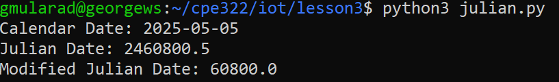


**Script 2:** `date_example.py`
This script prints out the date in multiple formats, as well as the date, month, year, and day fo teh week individually. It also compares the date to the first and last days of classes.
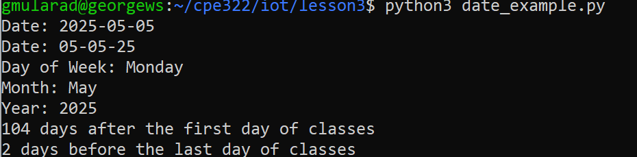


**Script 3:** `datetime_example.py`
This script prints out the current date and time multiple times.
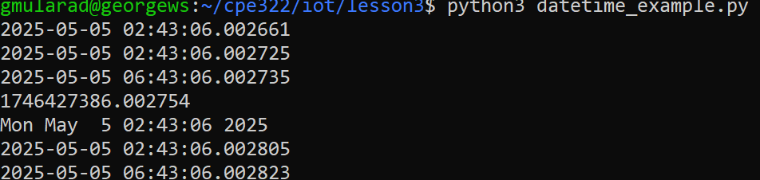


**Script 4:** `time_example.py`
This script prints the current date and time every 10 seconds.
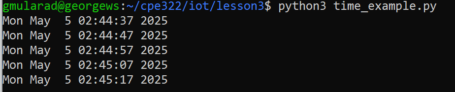


**Script 5:** `sun.py`
This script provides the time for various positions of the sun for the provided city, in this case NYC.
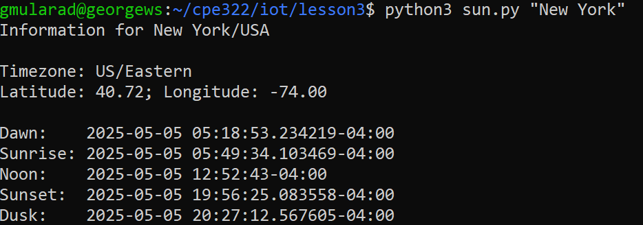


**Script 6:** `moon.py`
This script provides the phases of the moon for the next full cycle represented as integers, with 27 -> 0 being the new moon.
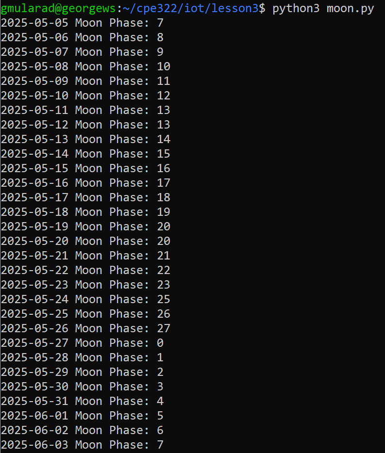


**Script 7:** `coordinates.py`
This script provides the address, as well as the latitude and longitude for the building provided. In this example the Stevens Library was used.
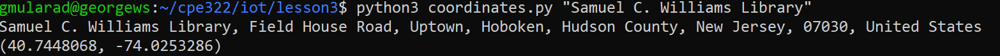


**Script 8:** `address.py`
This command takes provided latitude and longitude and converts that into the address of whatever building is located at those coordinates. Once again, the example used is the Stevens library.
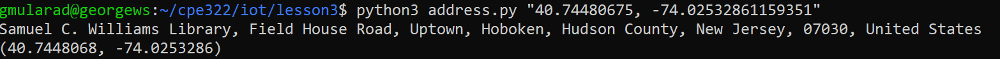


**Script 9:** `cpu.py`
Prints the numbers of physical and logical CPU cores on the machine, as well as each one's utilization.
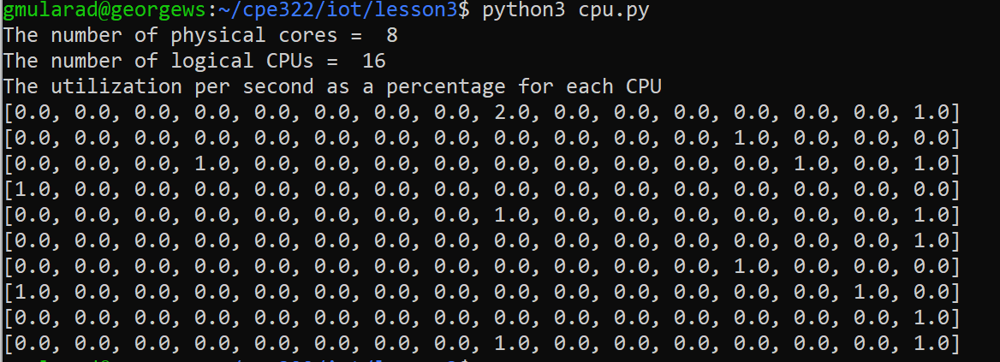


**Script 10:** `battery.py`
This displays various information related to the machine's power supply, such as the current battery percentage and whether it is unplugged.
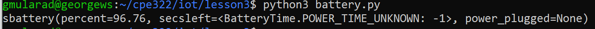


**Script 11:** `documentstats.py`
This script displays the word count of a document, as well as it's most common words and their frequencies.
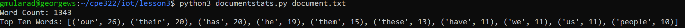


---
> "I pledge my Honor that I have abided by the Stevens Honor System." - George Mularadelis


