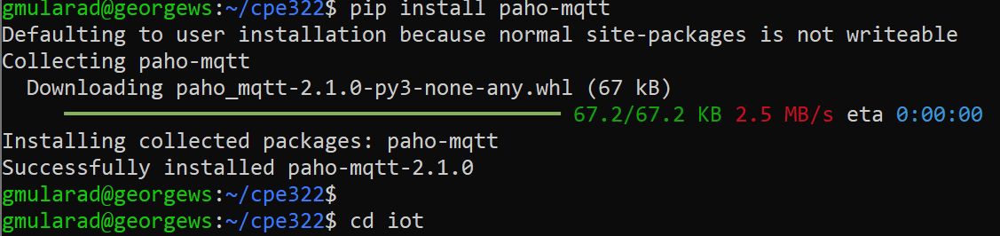
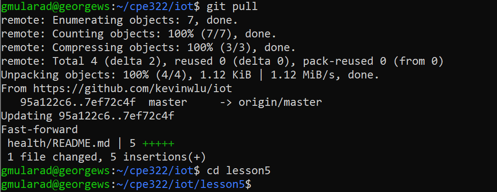
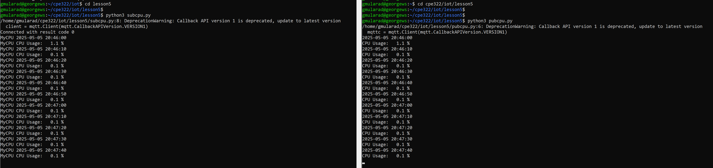

# CPE 322 Lab 5
## MQTT

### Introduction
This lab aims to familiarize me with the implementation of an MQTT protocol, used for communication over a network. In this lab I use the Paho-MQTT to communicate between 2 terminals.

**Dependencies:** 

The only dependency for this lab is the Paho-MQTT protocol itself. This can be installed with the Python package manager.
```
pip install paho-mqtt
```


After successfully installing the protocol, I navigated to the iot repository, and made sure it was up to date with the command `git pull`. 


Once updated, I navigated to the lesson5 directory to run the two scripts from two separate terminals. One running `subcpu.py`, and the other running `pubcpu.py`. These commands show the current CPU utilization of my computer, with both termianls being able to communicate with each other.



---
> "I pledge my Honor that I have abided by the Stevens Honor System." - George Mularadelis
