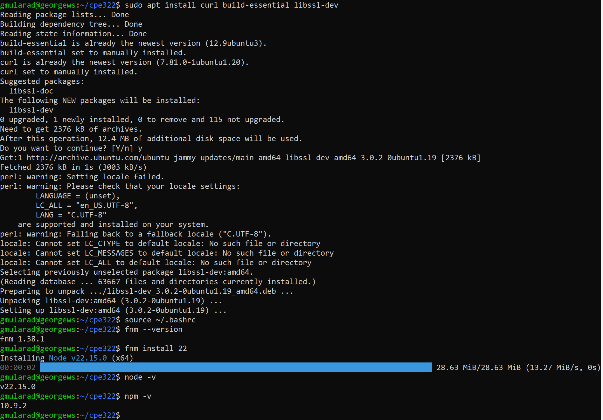
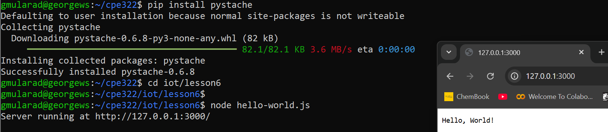
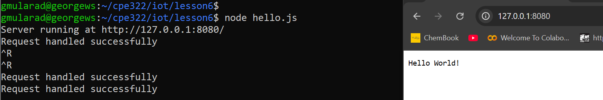
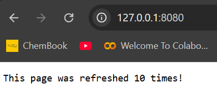
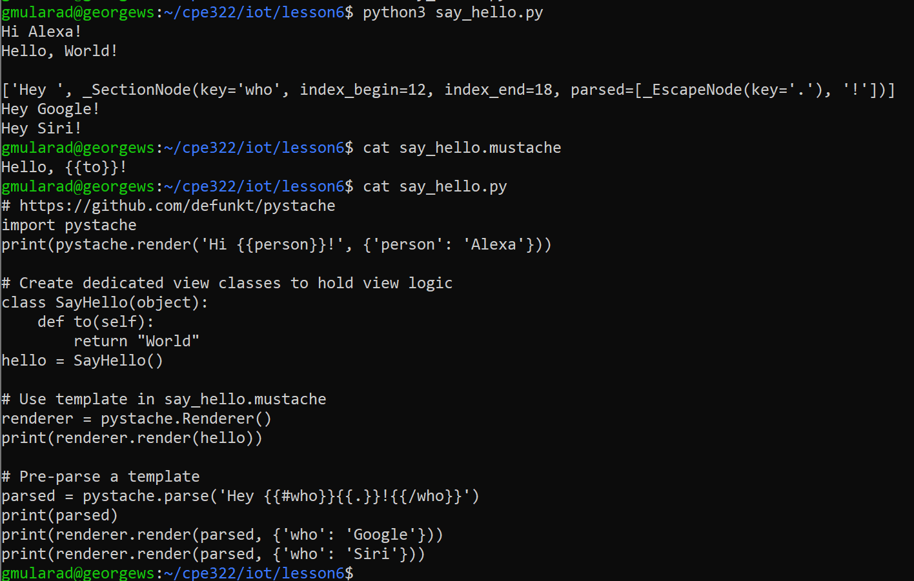

# CPE 322 Lab 6
## Node.js and Pystache

### Introduction
This lab aims to demonstrate the capabilities of python and some of its packages using sample scripts from the IOT repository.

**Dependencies:** 

To perform this lab, I will need to install Node JS, as well as Pystache. Node JS provides instructions on how to install it from [their website](https://nodejs.org/en/download/). I followed the instructinos for Linux as I use an Ubuntu distribution through WSL. I did have to install fnm to faciliate the install process.


To isntall pystache, we simply use the Python package manager.
```
pip install pystache
```

The first example is a program displaying the text "Hello, World!" This was run using `node hello-world.js`



The second example `hello.js` displays the same text, but shows in the terminal whenever the page is accessed or refreshed.



The third example `http.js` displays the amount of times the page was refreshed.



The final example to run is the pystache example `say_hello.py`. This code prints out the first line "Hi Alexa!" which is hard coded to be printed in the python script. The sceond output "Hello, World!" uses the .mustache file template to print this line, and the last three lines are printed out as part of the formatting in the python script.



---
> "I pledge my Honor that I have abided by the Stevens Honor System." - George Mularadelis
