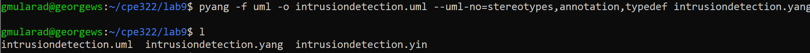

# CPE 322 Lab 9
## YANG

### Introduction
This lab aims to familiarize me with Pyang, a tool for describing data in network devices. It will also use PlantUML to create a diagram visualizing the results from the lab.

**Dependencies:** 

The first step in running these scripts is to make sure the proper python packages are installed. This can be done through pip, the package manager for python.
```
pip install pyang
pip install plantuml
```

With these scripts installed, I created a copy of the file `intrusiondetection.yang`. With this copy I created a .yin file of the same name with the command 
```
pyang -f yin -o intrusiondetection.yin intrusiondetection.yang
```


With the yin file successfully created, I then created the uml file that would be used to create the diagram png. The command I used was 
```
pyang -f uml -o intrusiondetections.uml --uml-no=stereotypes,annotation,typedef intrusiondetection.yang
```



With the uml file successfully created, the last step was to use PlantUML to create a diagram. This was done with the following command:
```
python -m plantuml intrusiondetection.uml
```


---
> "I pledge my Honor that I have abided by the Stevens Honor System." - George Mularadelis

