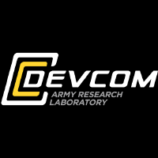

# ECE_322_D6
## Lab 0 README
### Using a Markdown Langauge

**About Me**
- 3/4 Computer Engineering Major
- Minoring in Mechatronics
- Currently a contractor with Army DEVCOM

[DEVCOM GitHub](https://github.com/usarmyresearchlab)

*Fun Facts*
1. Currently an IEEE member
2. I'm a self-taught musician
3. Was forklift certified at my old summer job

`print('Hello World!')`
---
> "We can only see a short distance ahead, but we can see plenty there that needs to be done." - Alan Turing
